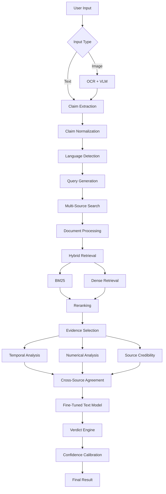

# VERIFY-X 2.0

> **Multimodal AI Fact Verification & Evidence Intelligence Platform**

[]()
[]()
[]()

VERIFY-X is an evidence-grounded AI verification system that combines fine-tuned language models, multimodal understanding, information retrieval, reranking, deterministic verification, source analysis, and calibrated confidence to verify claims across text and images in multiple languages.

## Architecture



## Key Features

- **Multilingual**: English, Hindi, Bengali, code-mixed text
- **Multimodal**: Text claims, screenshots, memes, infographics
- **Evidence-Grounded**: Every verdict backed by traceable sources
- **Hybrid Retrieval**: BM25 + dense embeddings + cross-encoder reranking
- **Fine-Tuned Models**: QLoRA-trained Qwen3-8B for fact verification
- **Deterministic Verification**: Temporal reasoning, numerical analysis
- **Calibrated Confidence**: Temperature-scaled confidence scores
- **Production Quality**: FastAPI, React, PostgreSQL, Redis, Docker

## Tech Stack

| Layer | Technology |
|-------|-----------|
| Text Model | Qwen/Qwen3-8B (QLoRA fine-tuned) |
| Vision Model | Qwen/Qwen2.5-VL-7B-Instruct |
| OCR | PaddleOCR |
| Backend | FastAPI, SQLAlchemy, PostgreSQL, Redis |
| Frontend | React, TypeScript, Vite, Tailwind CSS |
| Retrieval | BM25, FAISS, sentence-transformers |
| MLOps | MLflow, Hugging Face Hub |
| Deployment | Docker Compose |

## Quick Start

### Prerequisites

- Python 3.11+
- Node.js 20+
- Docker & Docker Compose
- Git

### Development Setup

```bash
# Clone
git clone https://github.com/your-username/verify-X.git
cd verify-X

# Copy environment config
cp .env.example .env

# Start infrastructure
docker-compose up -d postgres redis

# Backend
cd backend
python -m venv venv
source venv/bin/activate  # or venv\Scripts\activate on Windows
pip install -r requirements.txt
uvicorn app.main:app --reload --port 8000

# Frontend (new terminal)
cd frontend
npm install
npm run dev
```

### Docker (Full Stack)

```bash
docker-compose up --build
```

## Project Structure

```
VERIFY-X/
├── backend/          # FastAPI application
├── frontend/         # React + TypeScript + Vite
├── ml/               # ML training, evaluation, configs
│   ├── configs/      # YAML training configs
│   ├── data/         # Dataset storage
│   ├── preprocessing/# Data preprocessing pipeline
│   ├── training/     # Training scripts (Colab-compatible)
│   ├── evaluation/   # Metrics, error analysis, benchmarks
│   ├── inference/    # Inference utilities
│   └── notebooks/    # Jupyter notebooks
├── scripts/          # Shell scripts
├── docs/             # Documentation
└── docker-compose.yml
```

## Training

Fine-tuning is designed to run in Google Colab:

1. Open `ml/notebooks/03_train_text_model.ipynb` in Google Colab
2. Run all cells
3. The adapter will be saved to Hugging Face Hub

Then configure VERIFY-X to use the adapter:

```env
TEXT_ADAPTER=your-username/verifyx-text-v1
```

## API

| Endpoint | Method | Description |
|----------|--------|-------------|
| `/api/v1/verify/text` | POST | Verify a text claim |
| `/api/v1/verify/image` | POST | Verify an image |
| `/api/v1/verification/{id}` | GET | Get verification result |
| `/api/v1/history` | GET | Get verification history |
| `/api/v1/feedback` | POST | Submit feedback |
| `/api/v1/health` | GET | Health check |
| `/api/v1/models` | GET | Model information |

## License

MIT
