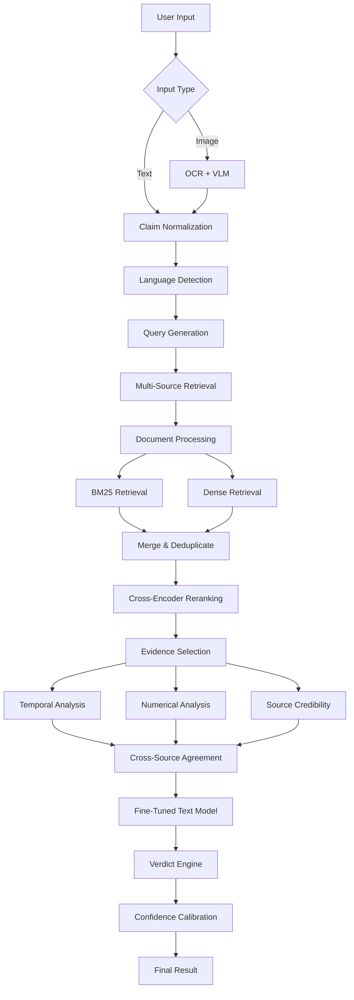
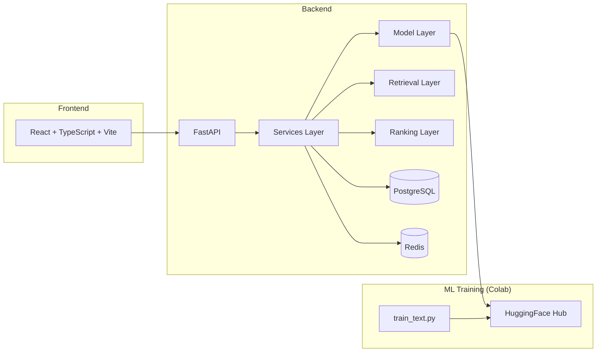

# VERIFY-X 2.0 — Architecture

## System Overview

VERIFY-X 2.0 is a multimodal AI fact verification platform that processes claims through a multi-stage pipeline combining information retrieval, hybrid ranking, fine-tuned language models, deterministic verification, and calibrated confidence scoring.

## Pipeline Architecture

## Component Architecture

## Key Design Decisions

1. **Independently replaceable components** — Every major component (text model, vision model, OCR, retriever, reranker, etc.) implements an interface that can be swapped without rewriting the application.

2. **Hybrid retrieval** — BM25 for lexical matching + dense embeddings for semantic matching, merged and reranked with a cross-encoder.

3. **Deterministic over probabilistic** — Numerical verification and temporal reasoning use deterministic computation rather than LLM arithmetic.

4. **Calibrated confidence** — Raw model probabilities are calibrated using temperature scaling to reflect empirical reliability.

5. **Mandatory evidence grounding** — Every verdict is backed by traceable evidence. No evidence = NOT_ENOUGH_INFORMATION.
